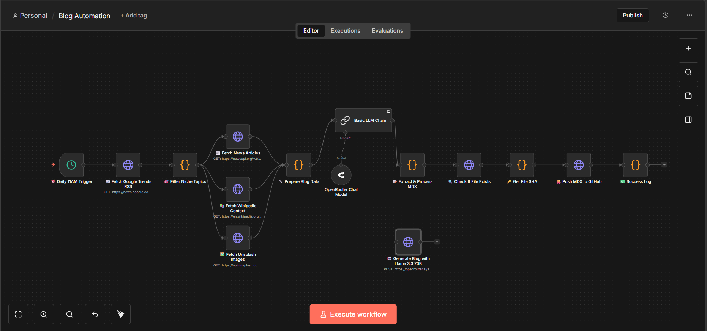

# PulseBlog Auto Publisher (n8n Workflow)

An autonomous, AI-driven content generation and publishing engine built in n8n. The system runs daily to catch top tech trends, research context from multiple APIs, generate deep MDX articles, and commit them directly to a frontend GitHub repository.<br>

## 📌 The Problem

Running a high-quality technology blog requires continuous effort. Creators face several everyday challenges:

* **Trend Fatigue:** Spending hours manually checking RSS feeds, Google Trends, and news sites to see what is relevant today.
* **Shallow Content:** AI writers often produce generic text because they lack real-time news data or verified background context.
* **Publishing Friction:** Manually formatting text into MDX with strict frontmatter, downloading cover images, and copying files into a Git repo takes too many steps.

---

## 🚀 The Solution & Impact

This workflow builds an automated pipeline that handles the work of a trend researcher, content writer, and web developer all at once.

### The Impact

* **True Real-Time Context:** The AI does not rely purely on its static training data. It writes using live news data and verified encyclopedic context fetched at the moment of execution.


* **Zero-Touch Publishing:** Articles are generated directly in MDX format with correct layout structures (like custom layout callouts and charts) and pushed live without human intervention.


* **Smart Filtering:** The script automatically filters out generic news to focus strictly on high-value niches like Artificial Intelligence, Cybersecurity, and Space Science.


---

## 🛠️ Tech Stack

* **Workflow Automation:** n8n


* **Content Generation:** Llama 3.3 70B Instruct (via OpenRouter API)


* **Data & Context APIs:** Google News RSS, NewsAPI, Wikipedia API, Unsplash API


* **Deployment Target:** GitHub API (Targeting Next.js/Astro static blog structures using MDX)


---

## 📐 System Architecture & Workflow

The architecture is built as a linear data pipeline that enriches a single chosen topic step-by-step.

```
[Daily Trigger] ➔ [Google Trends RSS] ➔ [Niche Selection Filter]
                                                   │
[MDX Processing] ◀── [Llama 3.3 70B] ◀── [News, Wiki & Image Context]
       │
[GitHub Repo Commit] ➔ [Live Production Blog]

```

### 1. Discovery Phase

* **⏰ Daily 11AM Trigger:** A cron node kicks off the workflow every single day at 11:00 AM.


* **📈 Fetch Google Trends RSS:** Downloads the latest global trending topics across technology and science terms.


* **🎯 Filter Niche Topics:** A JavaScript node scores the RSS feed data against specific industry keywords (e.g., *LLM, cyber, quantum, semiconductor*). It isolates the single highest-scoring topic to write about.


### 2. Context Enrichment Phase

Once a topic is chosen, the workflow queries three separate platforms in parallel to build a complete research profile:

* **📰 Fetch News Articles:** Grabs the top 5 most recent live news stories on the topic for real-time reference.


* **📚 Fetch Wikipedia Context:** Obtains foundational definitions and verified background data to keep the article grounded and accurate.


* **🖼️ Fetch Unsplash Images:** Searches for high-quality, landscape-oriented cover photos matching the topic keywords.


### 3. Generation & MDX Parsing Phase

* **🔧 Prepare Blog Data:** Cleans all incoming API text, structures the citations, determines categories, and creates a clean URL slug.


* **Basic LLM Chain:** Feeds the entire structured research package to **Llama 3.3 70B**. The prompt enforces strict formatting: frontmatter headers, H2/H3 layouts, an info Callout box, and a structured UI Markdown Growth Chart component.


* **📝 Extract & Process MDX:** Extracts the raw text output, cleans away accidental markdown fences, fixes tag arrays, and converts the final post into a Base64 string for safe web transfer.


### 4. Git Git-Ops Integration Phase

* **🔍 Check If File Exists:** Contacts the repository to see if a post with that slug already exists.


* **🔑 Get File SHA:** Captures the unique file SHA signature if updating an existing file, ensuring standard Git rules are followed.


* **🐙 Push MDX to GitHub:** Sends a `PUT` request to commit the `.mdx` file directly into your production directory branch (`content/posts/`). This trigger fires your blog's live web deployment pipeline (e.g., Vercel or Netlify).


---

## ⚙️ Setup Instructions

1. **Import Workflow:** Copy the JSON data structure for this workflow and paste it directly onto your n8n workspace canvas.


2. **Configure API Secrets:**
* Replace the placeholder Bearer tokens inside the **NewsAPI**, **Unsplash**, and **OpenRouter** nodes with your personal credentials.


* Generate a personal access token (PAT) on GitHub with file writing rights and save it inside the **GitHub** request headers.


3. **Repository Paths:** Update the repository path string (`Himanshu-Vishwakarma-GH/ai-tech-blog`) inside the file management nodes to point directly to your personal web repo.


---
